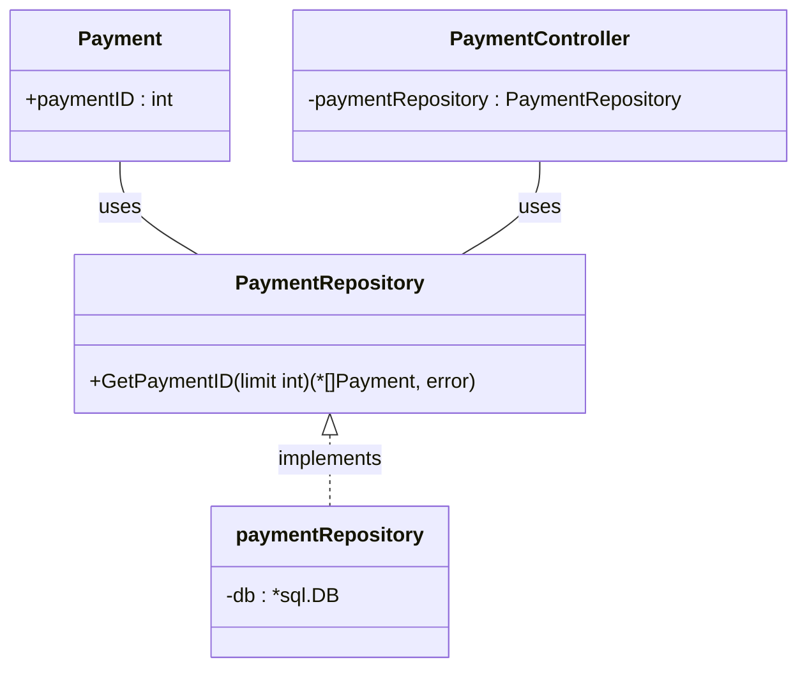

# go-sandbox-clean
```bash
sudo chmod -R 777 /go/
go get github.com/lib/pq
```


```mermaid
classDiagram
    class Payment {
        +paymentID : int
    }
    class PaymentRepository{
        +GetPaymentID(limit int) (*[]Payment, error)
    }
    class paymentRepository {
        -db : *sql.DB
    }
    class PaymentController {
        -paymentRepository : PaymentRepository
    }
    Payment -- PaymentRepository : uses
    PaymentRepository <|.. paymentRepository : implements
    PaymentController -- PaymentRepository : uses
```
