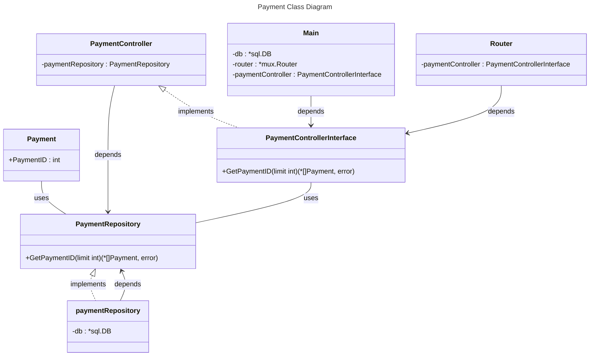

# go-sandbox-clean

```mermaid
---
title: Payment Class Diagram
---
classDiagram
    class Payment {
        +PaymentID : int
    }

    class PaymentRepository {
        +GetPaymentID(limit int) (*[]Payment, error)
    }

    class paymentRepository {
        -db : *sql.DB
    }

    class PaymentControllerInterface {
        +GetPaymentID(limit int) (*[]Payment, error)
    }

    class PaymentController {
        -paymentRepository : PaymentRepository
    }

    class Main {
        -db : *sql.DB
        -router : *mux.Router
        -paymentController : PaymentControllerInterface
    }

    class Router {
        -paymentController : PaymentControllerInterface
    }

    Payment -- PaymentRepository : uses
    PaymentRepository <|.. paymentRepository : implements
    paymentRepository --> PaymentRepository : depends
    PaymentController --> PaymentRepository : depends
    PaymentController <|.. PaymentControllerInterface : implements
    PaymentControllerInterface -- PaymentRepository : uses
    Main --> PaymentControllerInterface : depends
    Router --> PaymentControllerInterface : depends
```
